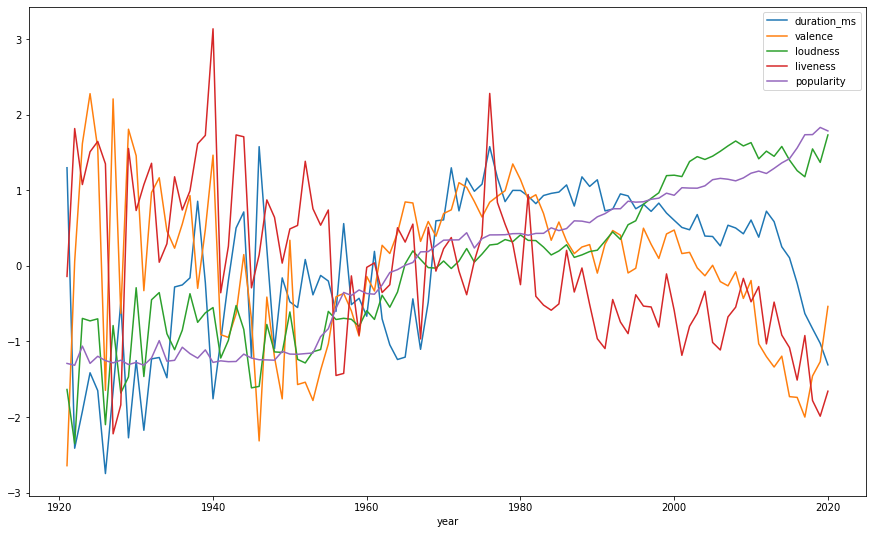

## Simple takeaways / conclusion: 
### 1. The newer music tends to be more popular and louder in this data set. But loudness doesn't necessarily lead to popularity. 

### 2. Since the 1980s, liveness and the duration of music have tended to go down. The liveness trend makes sense since we create more music in studios.

### 3.The chart shows no apparent trend between time and valence. This is surprising since I thought the music during the dot com bubble and financial crisis would be more negative. 

## let get started


```python
import numpy as np
import pandas as pd
import seaborn as sb
import matplotlib.pyplot as plt
```


```python
# read data
df = pd.read_csv("data.csv")
df.head()
```


<div>
<style scoped>
    .dataframe tbody tr th:only-of-type {
        vertical-align: middle;
    }

    .dataframe tbody tr th {
        vertical-align: top;
    }

    .dataframe thead th {
        text-align: right;
    }
</style>
<table border="1" class="dataframe">
  <thead>
    <tr style="text-align: right;">
      <th></th>
      <th>valence</th>
      <th>year</th>
      <th>acousticness</th>
      <th>artists</th>
      <th>danceability</th>
      <th>duration_ms</th>
      <th>energy</th>
      <th>explicit</th>
      <th>id</th>
      <th>instrumentalness</th>
      <th>key</th>
      <th>liveness</th>
      <th>loudness</th>
      <th>mode</th>
      <th>name</th>
      <th>popularity</th>
      <th>release_date</th>
      <th>speechiness</th>
      <th>tempo</th>
    </tr>
  </thead>
  <tbody>
    <tr>
      <th>0</th>
      <td>0.0594</td>
      <td>1921</td>
      <td>0.982</td>
      <td>['Sergei Rachmaninoff', 'James Levine', 'Berli...</td>
      <td>0.279</td>
      <td>831667</td>
      <td>0.211</td>
      <td>0</td>
      <td>4BJqT0PrAfrxzMOxytFOIz</td>
      <td>0.878000</td>
      <td>10</td>
      <td>0.665</td>
      <td>-20.096</td>
      <td>1</td>
      <td>Piano Concerto No. 3 in D Minor, Op. 30: III. ...</td>
      <td>4</td>
      <td>1921</td>
      <td>0.0366</td>
      <td>80.954</td>
    </tr>
    <tr>
      <th>1</th>
      <td>0.9630</td>
      <td>1921</td>
      <td>0.732</td>
      <td>['Dennis Day']</td>
      <td>0.819</td>
      <td>180533</td>
      <td>0.341</td>
      <td>0</td>
      <td>7xPhfUan2yNtyFG0cUWkt8</td>
      <td>0.000000</td>
      <td>7</td>
      <td>0.160</td>
      <td>-12.441</td>
      <td>1</td>
      <td>Clancy Lowered the Boom</td>
      <td>5</td>
      <td>1921</td>
      <td>0.4150</td>
      <td>60.936</td>
    </tr>
    <tr>
      <th>2</th>
      <td>0.0394</td>
      <td>1921</td>
      <td>0.961</td>
      <td>['KHP Kridhamardawa Karaton Ngayogyakarta Hadi...</td>
      <td>0.328</td>
      <td>500062</td>
      <td>0.166</td>
      <td>0</td>
      <td>1o6I8BglA6ylDMrIELygv1</td>
      <td>0.913000</td>
      <td>3</td>
      <td>0.101</td>
      <td>-14.850</td>
      <td>1</td>
      <td>Gati Bali</td>
      <td>5</td>
      <td>1921</td>
      <td>0.0339</td>
      <td>110.339</td>
    </tr>
    <tr>
      <th>3</th>
      <td>0.1650</td>
      <td>1921</td>
      <td>0.967</td>
      <td>['Frank Parker']</td>
      <td>0.275</td>
      <td>210000</td>
      <td>0.309</td>
      <td>0</td>
      <td>3ftBPsC5vPBKxYSee08FDH</td>
      <td>0.000028</td>
      <td>5</td>
      <td>0.381</td>
      <td>-9.316</td>
      <td>1</td>
      <td>Danny Boy</td>
      <td>3</td>
      <td>1921</td>
      <td>0.0354</td>
      <td>100.109</td>
    </tr>
    <tr>
      <th>4</th>
      <td>0.2530</td>
      <td>1921</td>
      <td>0.957</td>
      <td>['Phil Regan']</td>
      <td>0.418</td>
      <td>166693</td>
      <td>0.193</td>
      <td>0</td>
      <td>4d6HGyGT8e121BsdKmw9v6</td>
      <td>0.000002</td>
      <td>3</td>
      <td>0.229</td>
      <td>-10.096</td>
      <td>1</td>
      <td>When Irish Eyes Are Smiling</td>
      <td>2</td>
      <td>1921</td>
      <td>0.0380</td>
      <td>101.665</td>
    </tr>
  </tbody>
</table>
</div>


## Value Description: 
### Instrumentalness: 
This value represents the amount of vocals in the song. The closer it is to 1.0, the more instrumental the song is.

### Acousticness: 
This value describes how acoustic a song is. A score of 1.0 means the song is most likely to be an acoustic one.

### Liveness: 
This value describes the probability that the song was recorded with a live audience. According to the official documentation “a value above 0.8 provides strong likelihood that the track is live”.

### Speechiness: 
“Speechiness detects the presence of spoken words in a track”. If the speechiness of a song is above 0.66, it is probably made of spoken words, a score between 0.33 and 0.66 is a song that may contain both music and words, and a score below 0.33 means the song does not have any speech.

### Energy: 
“(energy) represents a perceptual measure of intensity and activity. Typically, energetic tracks feel fast, loud, and noisy”.

### Danceability: 
“Danceability describes how suitable a track is for dancing based on a combination of musical elements including tempo, rhythm stability, beat strength, and overall regularity. A value of 0.0 is least danceable and 1.0 is most danceable”.

### Valence: 
“A measure from 0.0 to 1.0 describing the musical positiveness conveyed by a track. Tracks with high valence sound more positive (e.g. happy, cheerful, euphoric), while tracks with low valence sound more negative (e.g. sad, depressed, angry)”.


```python
# get basic in of of dataframe
df.info()
```

    <class 'pandas.core.frame.DataFrame'>
    RangeIndex: 170653 entries, 0 to 170652
    Data columns (total 19 columns):
     #   Column            Non-Null Count   Dtype  
    ---  ------            --------------   -----  
     0   valence           170653 non-null  float64
     1   year              170653 non-null  int64  
     2   acousticness      170653 non-null  float64
     3   artists           170653 non-null  object 
     4   danceability      170653 non-null  float64
     5   duration_ms       170653 non-null  int64  
     6   energy            170653 non-null  float64
     7   explicit          170653 non-null  int64  
     8   id                170653 non-null  object 
     9   instrumentalness  170653 non-null  float64
     10  key               170653 non-null  int64  
     11  liveness          170653 non-null  float64
     12  loudness          170653 non-null  float64
     13  mode              170653 non-null  int64  
     14  name              170653 non-null  object 
     15  popularity        170653 non-null  int64  
     16  release_date      170653 non-null  object 
     17  speechiness       170653 non-null  float64
     18  tempo             170653 non-null  float64
    dtypes: float64(9), int64(6), object(4)
    memory usage: 24.7+ MB


### analyze data by time


```python
df_yr = df.groupby(['year']).size()
# df_yr.head()
df_yr.plot.line()
```


    <AxesSubplot:xlabel='year'>


    

    


```python
# get average data per year 
df2 = df.groupby("year").mean() 

# get some interesting data 
df2 = df2[["duration_ms", "valence", "loudness", "liveness", "popularity"]]
df2
```


<div>
<style scoped>
    .dataframe tbody tr th:only-of-type {
        vertical-align: middle;
    }

    .dataframe tbody tr th {
        vertical-align: top;
    }

    .dataframe thead th {
        text-align: right;
    }
</style>
<table border="1" class="dataframe">
  <thead>
    <tr style="text-align: right;">
      <th></th>
      <th>duration_ms</th>
      <th>valence</th>
      <th>loudness</th>
      <th>liveness</th>
      <th>popularity</th>
    </tr>
    <tr>
      <th>year</th>
      <th></th>
      <th></th>
      <th></th>
      <th></th>
      <th></th>
    </tr>
  </thead>
  <tbody>
    <tr>
      <th>1921</th>
      <td>260537.166667</td>
      <td>0.379327</td>
      <td>-17.048667</td>
      <td>0.205710</td>
      <td>0.653333</td>
    </tr>
    <tr>
      <th>1922</th>
      <td>165469.746479</td>
      <td>0.535549</td>
      <td>-19.275282</td>
      <td>0.240720</td>
      <td>0.140845</td>
    </tr>
    <tr>
      <th>1923</th>
      <td>177942.362162</td>
      <td>0.625492</td>
      <td>-14.129211</td>
      <td>0.227462</td>
      <td>5.389189</td>
    </tr>
    <tr>
      <th>1924</th>
      <td>191046.707627</td>
      <td>0.663725</td>
      <td>-14.231343</td>
      <td>0.235219</td>
      <td>0.661017</td>
    </tr>
    <tr>
      <th>1925</th>
      <td>184986.924460</td>
      <td>0.621929</td>
      <td>-14.146414</td>
      <td>0.237668</td>
      <td>2.604317</td>
    </tr>
    <tr>
      <th>...</th>
      <td>...</td>
      <td>...</td>
      <td>...</td>
      <td>...</td>
      <td>...</td>
    </tr>
    <tr>
      <th>2016</th>
      <td>221396.510295</td>
      <td>0.431532</td>
      <td>-8.061056</td>
      <td>0.181170</td>
      <td>59.647190</td>
    </tr>
    <tr>
      <th>2017</th>
      <td>211115.696787</td>
      <td>0.416476</td>
      <td>-8.312630</td>
      <td>0.191713</td>
      <td>63.263554</td>
    </tr>
    <tr>
      <th>2018</th>
      <td>206001.007133</td>
      <td>0.447921</td>
      <td>-7.168785</td>
      <td>0.176326</td>
      <td>63.296243</td>
    </tr>
    <tr>
      <th>2019</th>
      <td>201024.788096</td>
      <td>0.458818</td>
      <td>-7.722192</td>
      <td>0.172616</td>
      <td>65.256542</td>
    </tr>
    <tr>
      <th>2020</th>
      <td>193728.397537</td>
      <td>0.501048</td>
      <td>-6.595067</td>
      <td>0.178535</td>
      <td>64.301970</td>
    </tr>
  </tbody>
</table>
<p>100 rows × 5 columns</p>
</div>


```python
# normalize data since the number is in different scale
normalized_df=(df2-df2.mean())/df2.std()
normalized_df.info()
normalized_df.head()
```

    <class 'pandas.core.frame.DataFrame'>
    Int64Index: 100 entries, 1921 to 2020
    Data columns (total 5 columns):
     #   Column       Non-Null Count  Dtype  
    ---  ------       --------------  -----  
     0   duration_ms  100 non-null    float64
     1   valence      100 non-null    float64
     2   loudness     100 non-null    float64
     3   liveness     100 non-null    float64
     4   popularity   100 non-null    float64
    dtypes: float64(5)
    memory usage: 4.7 KB


<div>
<style scoped>
    .dataframe tbody tr th:only-of-type {
        vertical-align: middle;
    }

    .dataframe tbody tr th {
        vertical-align: top;
    }

    .dataframe thead th {
        text-align: right;
    }
</style>
<table border="1" class="dataframe">
  <thead>
    <tr style="text-align: right;">
      <th></th>
      <th>duration_ms</th>
      <th>valence</th>
      <th>loudness</th>
      <th>liveness</th>
      <th>popularity</th>
    </tr>
    <tr>
      <th>year</th>
      <th></th>
      <th></th>
      <th></th>
      <th></th>
      <th></th>
    </tr>
  </thead>
  <tbody>
    <tr>
      <th>1921</th>
      <td>1.296931</td>
      <td>-2.643056</td>
      <td>-1.635625</td>
      <td>-0.140410</td>
      <td>-1.290754</td>
    </tr>
    <tr>
      <th>1922</th>
      <td>-2.412286</td>
      <td>0.059319</td>
      <td>-2.352590</td>
      <td>1.815071</td>
      <td>-1.315508</td>
    </tr>
    <tr>
      <th>1923</th>
      <td>-1.925646</td>
      <td>1.615176</td>
      <td>-0.695566</td>
      <td>1.074566</td>
      <td>-1.062004</td>
    </tr>
    <tr>
      <th>1924</th>
      <td>-1.414357</td>
      <td>2.276539</td>
      <td>-0.728452</td>
      <td>1.507830</td>
      <td>-1.290383</td>
    </tr>
    <tr>
      <th>1925</th>
      <td>-1.650790</td>
      <td>1.553531</td>
      <td>-0.701105</td>
      <td>1.644616</td>
      <td>-1.196518</td>
    </tr>
  </tbody>
</table>
</div>


```python
normalized_df.plot(figsize=(15, 9))
```


    <AxesSubplot:xlabel='year'>


    

    


## simple takeaways: 
### 1. The newer music tends to be more popular and louder in this data set. But loudness doesn't necessarily lead to popularity. 

### 2. Since the 1980s, liveness and the duration of music have tended to go down. The liveness trend makes sense since we create more music in studios.

### 3.The chart shows no apparent trend between time and valence. This is surprising since I thought the music during the dot com bubble and financial crisis would be more negative. 
